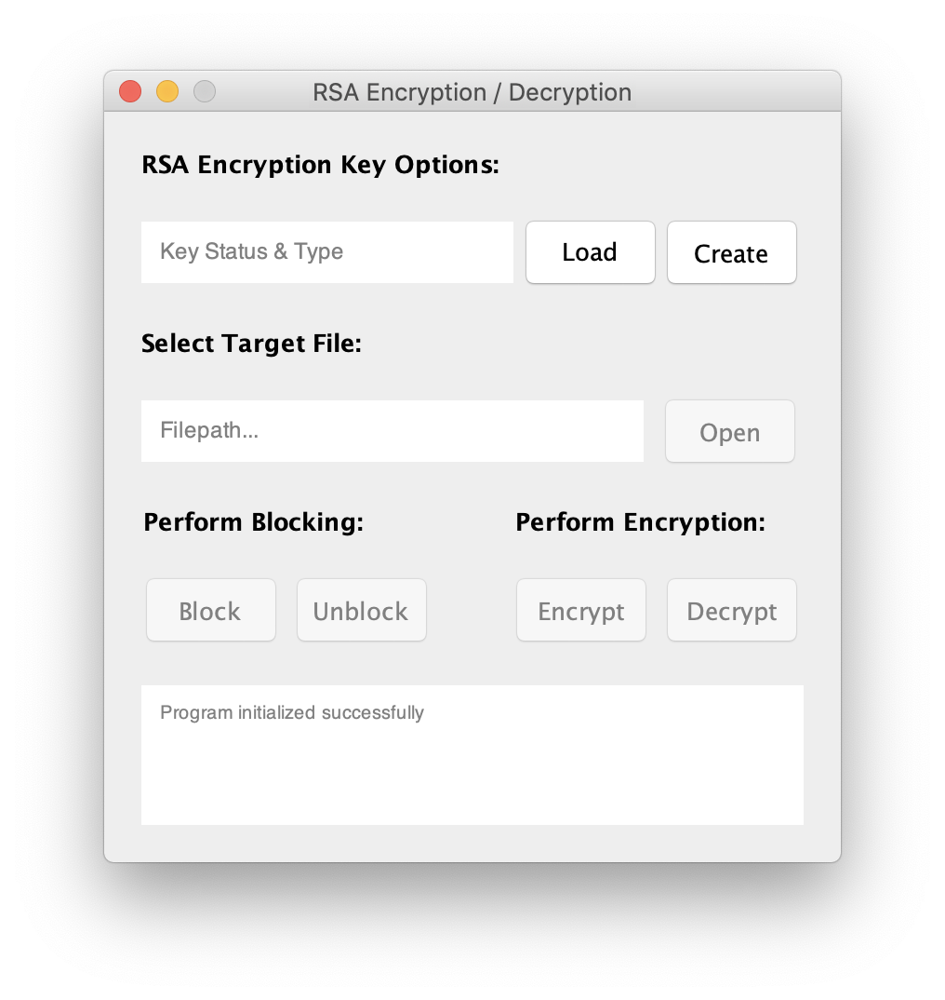
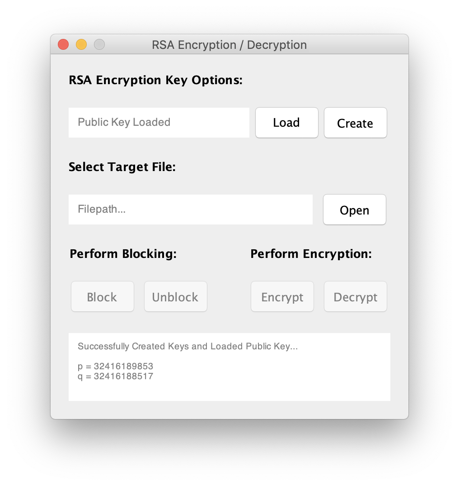
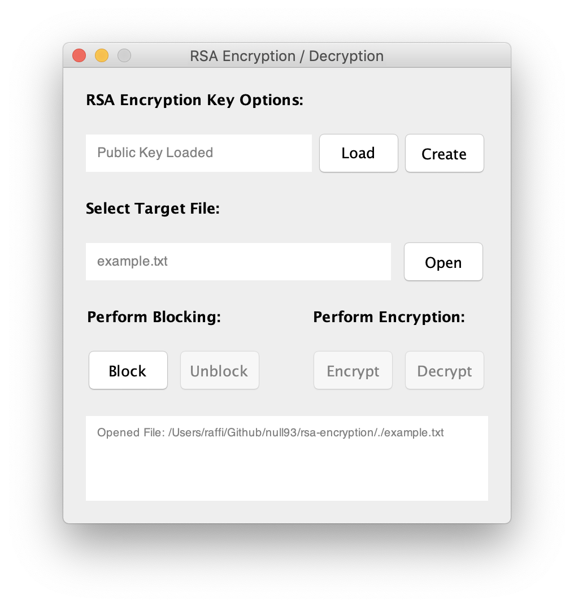
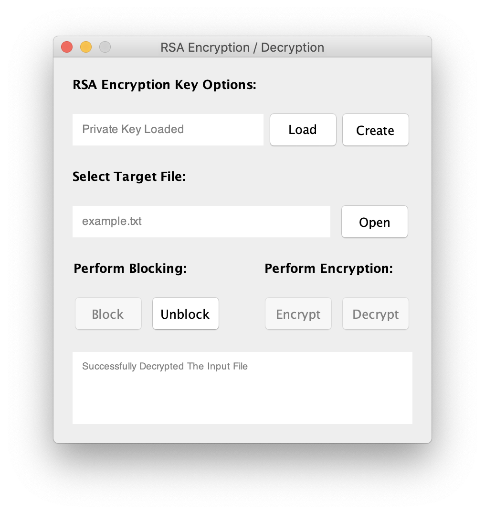
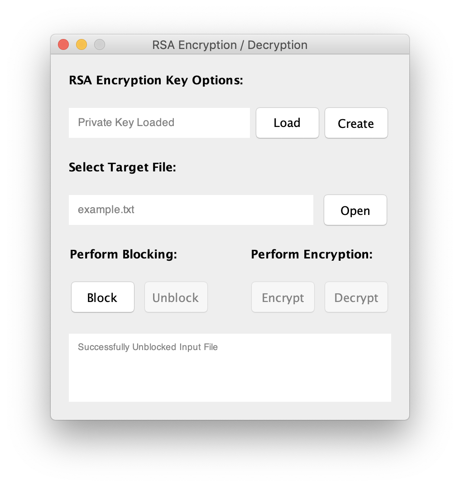

# RSA Encryption
> Implementation of the RSA encryption algorithm using big-integer algebra algorithms


<p align="center" >
	
</p>

## About

This program implements **RSA** key encryption and decryption.  There is a file called [src/resources/primes.rsc](src/resources/primes.rsc) that contains a list of large prime numbers.  These primes are used to generate private and public keys.  When the program starts, you can either load in an already generated key pair, or you can create new ones.  The new keys will be in a folder called *output* in the project directory.  Inside there is a file heiarchy that will represent a when a key was generated through the use of a timestamped folder.  Inside said folders, there are public and private keys in XML format.  When a key is generated, it is important to note that only one key can be loaded at a time, hence you can only encrypt or decrypt if you loaded the appropriate key.  The public key allows for encryption, while the private key allows for decryption.

## Building & Running & Cleaning

This project uses Maven as it's build system. If you would like to build and run the application from source, then the following commands will prove useful.

#### Compile Classes & Package JAR

```shell
mvn package
```

#### Run Main Class From JAR

```shell
java -cp target/rsa_encryption-1.0.0.jar com.rsa_encryption.RSA
```

#### Clean Generated Files

> This will not delete the output folder that contain your generated key pairs.

```shell
mvn clean
```

## Encryption & Decrytion Steps

###### 1. Run the program

<p align="center" >
	
</p>

###### 2. Click *Create*, public key will be loaded

<p align="center" >
	
</p>

###### 3. Click *Open*, and select file to encrypt

<p align="center" >
	
</p>

###### 4. Click *Block*

<p align="center" >
	
</p>

###### 5. Click *Encrypt*, and your file will be encrypted

<p align="center" >
	
</p>

###### 6. To decrypt, click *Load*, navigate to generated private key in *output* directory

<p align="center" >
	
</p>

###### 7. Click *Decrypt*

<p align="center" >
	
</p>

###### 8. Click *Unblock*, and your original file will be in it's original state

<p align="center" >
	
</p>

## Additional Notes

- http://doctrina.org/How-RSA-Works-With-Examples.html

> This source was used to better understand how RSA encryption works and how the key generation process works.

- http://www.tutorialspoint.com/java_xml/java_dom_create_document.htm

> This source was used to learn how to parse and write XML files in the Java language.

- https://www.khanacademy.org/computing/computer-science/cryptography/modarithmetic/a/fast-modular-exponentiation

> This source was used to better explain how to expand a exponential operation using the Eclidean explansion algorithm.
